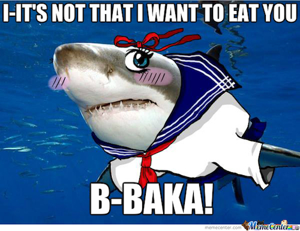

# Ruined Underground Nihilistic Autonomous Screed // RUNAS

Friday roundup, written whenever, because NO GODS, NO SCHEDULES.

# Ask Stefan Anything

_editor's note: this is the first week that no one asked "why." Things are looking up in the world..._
_editor's editor's note: save for one person, who asked it like… ironically man._

## quintessential 'why?'

quintessential "here's a nickel kid."

## why is it such a pain in the tuchus to switch git user?

I use the a `GIT_SSH_COMMAND` definition in an alias for the various ssh accounts I have with GitHub. It's a bit of a pain, yes, but using `loji_git` and `work_git` isn't terrible tbqh.

## who am i, why am i here?

You are the subject who understands all objects, but there is no teleological purpose to your existence. 

## What is your favorite Nick Cage Movie of all time?

I actually like "Nick Cage dressed awkwardly as a Russian in Kazakhstan" best.

## can we use blockchain to make cyborgs?

It would be interesting; if you look at blockchains such as Ethereum or BitCoin, you'll actually see that they are virtual machines with instructions. So, if we were to make cyborgs from blockchains, we could basically use an eventually-consistent lock-step consensus model for all of your cyborg armies. It would actually be similar to tree sheets or other actor-based consensus models, but with a proof of stake/work.

## Can you really choose a favorite from perfection?

I mean, we can still have _preferred indifferents_, sir. (ConAir)

## When do you think we'll find extraterrestrial life?

It's interesting right; who's to say we haven't already found them? How would you recognize something that doesn't fit our mental model for "life?"

## do you listen to podcasts? If so, what’s your fav?

so podcasts and the like are hard for me due to hearing difficulties, but I listen to a few; 

- Gary McGraw's Silver Bullet
- Noopcat's sunday maker channel
- Rally Sec's Tuesday review
- DefSec
- HanselMinutes

## Will you check out my fire mix tape?

_sends lewd image macro via text_

- Will senpai ever notice me?

## why is emacs the best editor?

Because you can install evil or spacemacs and forget that you're not using vim.

Also, ಠ\_ಠ

